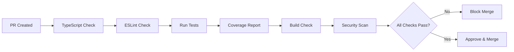
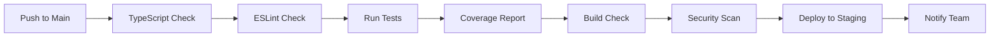

# CI/CD Guide

This guide explains the Continuous Integration and Continuous Deployment (CI/CD) pipeline for the Agri AI Agent Frontend project.

## Overview

The project uses GitHub Actions for CI/CD automation, including:
- Code quality checks (TypeScript, ESLint, Prettier)
- Automated testing
- Security scanning
- Build verification
- Deployment to staging and production

## CI/CD Pipeline Stages

### 1. Pull Request Pipeline

When you create a pull request, the following checks run:



### 2. Push to Main Branch

When you push to the `main` branch:



## GitHub Actions Workflows

### Workflow Files

All workflows are located in `.github/workflows/`:

- `ci.yml` - Continuous Integration pipeline
- `deploy.yml` - Deployment pipeline
- `security.yml` - Security scanning pipeline

### CI Pipeline (ci.yml)

The CI pipeline runs on every pull request and push to `main`:

#### Job 1: TypeScript Check

```yaml
- name: TypeScript Type Check
  run: npm run typecheck
```

**Purpose**: Validate type safety
**Expected result**: Zero TypeScript errors

#### Job 2: ESLint Check

```yaml
- name: ESLint Check
  run: npm run lint
```

**Purpose**: Ensure code quality standards
**Expected result**: Zero ESLint errors

#### Job 3: Run Tests

```yaml
- name: Run Tests
  run: npm run test:ci
```

**Purpose**: Execute comprehensive test suite
**Expected result**: All tests passing

#### Job 4: Coverage Report

```yaml
- name: Coverage Report
  run: npm run test:coverage
```

**Purpose**: Generate test coverage report
**Expected result**: Coverage > 90%

#### Job 5: Build Check

```yaml
- name: Build Check
  run: npm run build
```

**Purpose**: Verify production build works
**Expected result**: Build succeeds

#### Job 6: Security Scan

```yaml
- name: Security Scan
  run: npm audit --audit-level=high
```

**Purpose**: Scan for dependency vulnerabilities
**Expected result**: No high-severity vulnerabilities

#### Job 7: Deploy to Staging

```yaml
- name: Deploy to Staging
  uses: amondnet/vercel-action@v25
  with:
    vercel-token: ${{ secrets.VERCEL_TOKEN }}
    vercel-org-id: ${{ secrets.ORG_ID }}
    vercel-project-id: ${{ secrets.PROJECT_ID }}
    vercel-args: '--prod'
    working-directory: ./
```

**Purpose**: Deploy to staging environment
**Trigger**: Push to main branch

## Configuration

### Environment Variables

Configure these secrets in GitHub repository settings:

| Secret | Purpose |
|--------|---------|
| `VERCEL_TOKEN` | Vercel deployment token |
| `ORG_ID` | Vercel organization ID |
| `PROJECT_ID` | Vercel project ID |
| `DATABASE_URL` | Database connection string (staging) |
| `OPENAI_API_KEY` | OpenAI API key (staging) |

### Workflow Triggers

```yaml
on:
  push:
    branches: [main, develop]
  pull_request:
    branches: [main, develop]
```

## Deployment Process

### Staging Deployment

1. **Trigger**: Push to `main` branch
2. **Steps**:
   - Run all CI checks
   - Build production bundle
   - Deploy to staging environment
   - Run smoke tests
3. **Notification**: Slack/Email notification

### Production Deployment

1. **Trigger**: Manual approval or merge after successful staging
2. **Steps**:
   - Run all CI checks
   - Build production bundle
   - Deploy to production
   - Verify critical functionality
3. **Notification**: Team Slack channel

## Managing Workflows

### Viewing Workflow Runs

1. Go to **Actions** tab in GitHub
2. Select a workflow
3. View run details

### Viewing Logs

1. Click on a workflow run
2. Expand each job
3. Click on steps to view logs

### Canceling Workflow Runs

1. Go to **Actions** tab
2. Click on the workflow run
3. Click **Cancel run**

### Disabling Workflow

To disable a workflow temporarily:

```yaml
on: # Change to 'on: false' to disable
  push:
    branches: [main]
```

## Troubleshooting CI/CD

### Common Issues

#### Issue 1: Test Failures

**Error**: Tests failing in CI but passing locally

**Solutions**:
```bash
# Ensure exact same dependencies
npm ci

# Check Node.js version
node --version  # Should match CI environment

# Run with verbose output
npm test -- --verbose

# Check environment variables
echo $DATABASE_URL
```

#### Issue 2: Build Fails

**Error**: Build succeeds locally but fails in CI

**Solutions**:
```bash
# Clear build cache
rm -rf .next

# Check for environment variables
# Ensure all required env vars are set in GitHub Secrets

# Test build locally
npm run build
```

#### Issue 3: Security Scan Fails

**Error**: npm audit finding vulnerabilities

**Solutions**:
```bash
# Update vulnerable dependencies
npm audit fix

# If automatic fix doesn't work, update manually
npm install package-name@latest

# Check remaining vulnerabilities
npm audit --audit-level=high
```

#### Issue 4: Deployment Fails

**Error**: Vercel deployment fails

**Solutions**:
1. Check Vercel logs in dashboard
2. Verify environment variables are set
3. Check deployment configuration in `.vercel/project.json`
4. Retry deployment

## Customizing CI/CD

### Adding New Checks

Add new jobs to `.github/workflows/ci.yml`:

```yaml
- name: My Custom Check
  run: npm run my-check
```

### Modifying Triggers

Change when workflows run:

```yaml
on:
  push:
    branches: [main, develop, feature/*]
  pull_request:
    branches: [main]
  schedule:
    - cron: '0 0 * * 0'  # Weekly runs
```

### Adding Notifications

Add Slack notifications:

```yaml
- name: Notify on Failure
  if: failure()
  uses: 8398a7/action-slack@v3
  with:
    status: ${{ job.status }}
    webhook_url: ${{ secrets.SLACK_WEBHOOK }}
```

## Performance Optimization

### Cache Dependencies

```yaml
- name: Cache node modules
  uses: actions/cache@v3
  with:
    path: ~/.npm
    key: ${{ runner.os }}-node-${{ hashFiles('**/package-lock.json') }}
```

### Parallelize Jobs

```yaml
jobs:
  test:
    # ... test job
  lint:
    # ... lint job
  typecheck:
    # ... typecheck job

# These can run in parallel
```

### Reduce Build Time

```yaml
- name: Build (optimized)
  run: npm run build -- --mode production --progress
```

## Monitoring and Alerts

### Setup Monitoring

Use tools like:
- Vercel Analytics
- GitHub Actions Monitoring
- Datadog or New Relic (optional)

### Create Alerts

Set up alerts for:
- Build failures
- High severity vulnerabilities
- Performance degradation
- Deployment failures

## Best Practices

### 1. Keep Tests Fast

```yaml
# Use --maxWorkers=2 in CI
npm run test:ci
```

### 2. Use Environment-Specific Configs

```env
# .env.production for production
DATABASE_URL=${{ secrets.PROD_DATABASE_URL }}
OPENAI_API_KEY=${{ secrets.PROD_OPENAI_API_KEY }}
```

### 3. Document All Secrets

Maintain a README with:
- All required secrets
- How to generate them
- Security best practices

### 4. Regular Dependency Updates

Use Dependabot:
```yaml
dependabot:
  schedule:
    - interval: "weekly"
  open-pull-requests-limit: 5
```

### 5. Monitor Workflow Performance

Track:
- Average build time
- Success rate
- Most common failures

## rollback Strategy

### Automatic Rollback

```yaml
- name: Deploy to Production
  run: vercel --prod
  if: success()

- name: Smoke Test
  run: npm run smoke-test

- name: Rollback on Failure
  if: failure()
  run: vercel rollback --prod
```

### Manual Rollback

```bash
# Via Vercel CLI
vercel rollback --prod

# Via Vercel Dashboard
# 1. Go to Deployments
# 2. Click on the deployment to rollback
# 3. Click "Rollback to this version"
```

## CI/CD Checklist

Before merging code:

- [ ] All CI checks passing
- [ ] Tests passing (100%)
- [ ] Code coverage > 90%
- [ ] No ESLint errors
- [ ] No TypeScript errors
- [ ] Security scan clean
- [ ] Documentation updated
- [ ] Changelog updated
- [ ] Tested in staging environment

## Additional Resources

- [GitHub Actions Documentation](https://docs.github.com/en/actions)
- [Vercel Deployment](https://vercel.com/docs/deployments)
- [Next.js Deployment](https://nextjs.org/docs/deployment)
- [npm audit](https://docs.npmjs.com/cli/v9/commands/npm-audit)

---

For support or questions about CI/CD:
- **GitHub Issues**: [Repository Issues](https://github.com/yourusername/agri-ai-agent-frontend/issues)
- **Development Team**: Contact via GitHub
